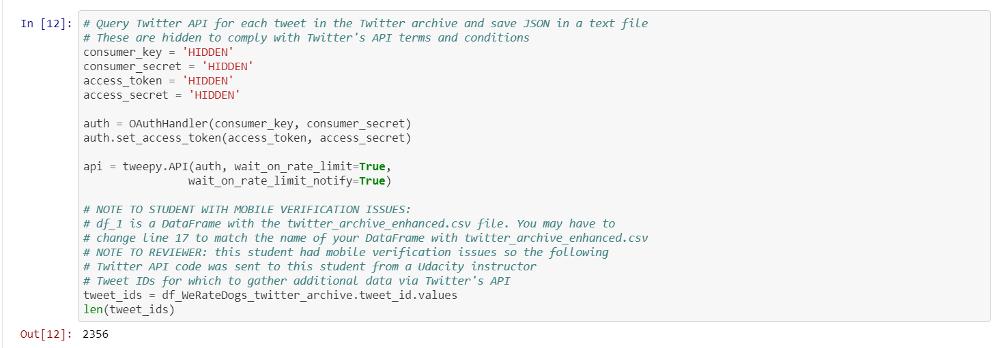
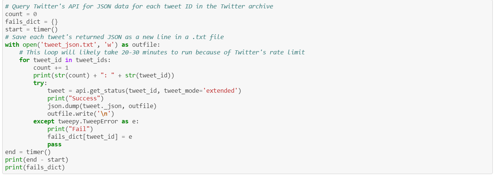

## Table of Content 
* [Introduction](#Introduction)
* [Project Overview](#Project-Overview)
* [Resources](#Resources)

## Introduction
Real-world data rarely comes clean. Using Python and its libraries, I gathered data from a variety of sources and in a variety of formats, assess its quality and tidiness, then clean it. This is called data wrangling. I documented my wrangling efforts in a Jupyter Notebook, plus showcase them through analyses and visualizations using Python (and its libraries) and/or SQL.

The dataset that I wrangled (and analyzing and visualizing) is the tweet archive of Twitter user [@dog_rates](https://twitter.com/dog_rates), also known as [WeRateDogs](https://twitter.com/dog_rates). WeRateDogs is a Twitter account that rates people's dogs with a humorous comment about the dog. These ratings almost always have a denominator of 10. The numerators, though? Almost always greater than 10. 11/10, 12/10, 13/10, etc. Why? Because "they're good dogs Brent." WeRateDogs has over 8.8 million followers and has received international media coverage.

WeRateDogs downloaded their Twitter archive and sent it to Udacity via email exclusively for udacity's student to use in this project. This archive contains basic tweet data (tweet ID, timestamp, text, etc.) for all 5000+ of their tweets as they stood on August 1, 2017. More on this soon.

## Project Overview
[wrangle_act.ipynb](https://github.com/Haitham-Darwish/Nano-degree/blob/master/Data%20Analysis/Wrangle%20and%20Analyze%20Data/wrangle_act.ipynb) used to organized and analysis twitter account [WeRateDogs](https://twitter.com/dog_rates)
this project aims to teach us data wrangling. So, the Udacity team did all the previous steps
then I continued the wrangling
Data Wrangling is to 
   * [Gather](#Gather) data
   * [Assess](#Assess) it
   * Then [Clean](#Clean)

However, I didn't stop at that, I have also made some visualization, as human tends to learn from image and understand it
more than text, then make some insights about it.

### Gather 
 First, step in data wrangling, we collect data as much as possible.
 
### Assess
 Second, step in data wrangling is to extract the issues to [clean](#Clean) in cleaning
### Clean 
 Third, and the last step is to fix the issues that extracted from [assessing](#Assess)
 
Get more info about the three steps from [wrangle_report.pdf](https://github.com/Haitham-Darwish/Nano-degree/blob/master/Data%20Analysis/Wrangle%20and%20Analyze%20Data/wrangle_report.pdf) where you will find what is [twitter-archive-enhanced.csv](https://github.com/Haitham-Darwish/Nano-degree/blob/master/Data%20Analysis/Wrangle%20and%20Analyze%20Data/twitter-archive-enhanced.csv), [tweet_json.txt](https://github.com/Haitham-Darwish/Nano-degree/blob/master/Data%20Analysis/Wrangle%20and%20Analyze%20Data/tweet_json.txt) and [image-predictions.tsv](https://github.com/Haitham-Darwish/Nano-degree/blob/master/Data%20Analysis/Wrangle%20and%20Analyze%20Data/image-predictions.tsv)
 
After [cleaning](#Clean) we store the data and visualize it to get most from the data and understand it more, I have stored the cleaned data in [twitter_archive_master.csv](https://github.com/Haitham-Darwish/Nano-degree/blob/master/Data%20Analysis/Wrangle%20and%20Analyze%20Data/twitter_archive_master.csv) and all_collumns.db which is an SQL file.
 
I have visualized the data and make some insights in [act_report.pdf](https://github.com/Haitham-Darwish/Nano-degree/blob/master/Data%20Analysis/Wrangle%20and%20Analyze%20Data/act_report.pdf)
 
***How to Run the program***
open Jupyter notebook by opening cmd, git bash, or terminal and type

<pre>
<code>
cd Nano-degree/Data Analysis/Wrangle and Analyze Data
</code>
</pre>
or
<pre >
<code>
cd Nano-degree\Data Analysis\Wrangle and Analyze Data
</code>
</pre>

if windows (cmd)
<pre >
<code>
jupyter notebook
</code>
</pre>

You can run all the cells except    

as the api is not available. You can read the file directly.
 
## Resources
* [pandas](https://pandas.pydata.org)
* [Udacity](https://classroom.udacity.com/nanodegrees/nd002-mena-nfp2/dashboard/overview)
* [latinacode](https://github.com/latinacode/Wrangle-and-Analyze-Data)
* [StefaniePowazny](https://github.com/StefaniePowazny/Wrangle-and-Analyze-Data)
* [twitter-api](https://developer.twitter.com/en/docs/twitter-api/v1/data-dictionary/overview/tweet-object)
* [python-tweepy-getting-the-source-of-a-tweet](https://www.geeksforgeeks.org/python-tweepy-getting-the-source-of-a-tweet/)
